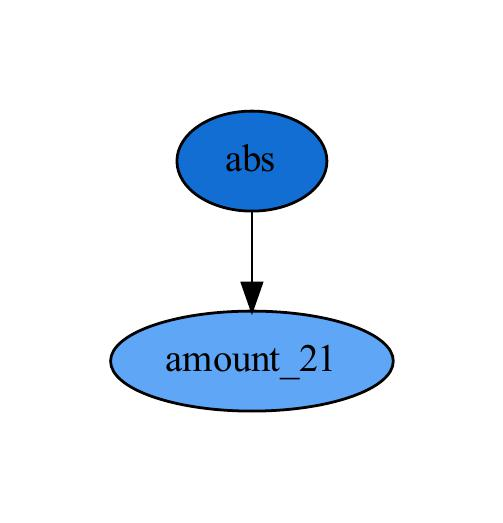
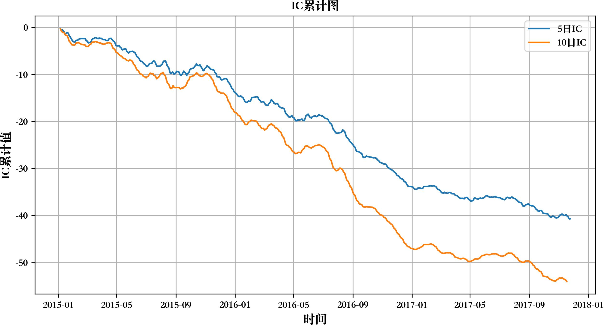
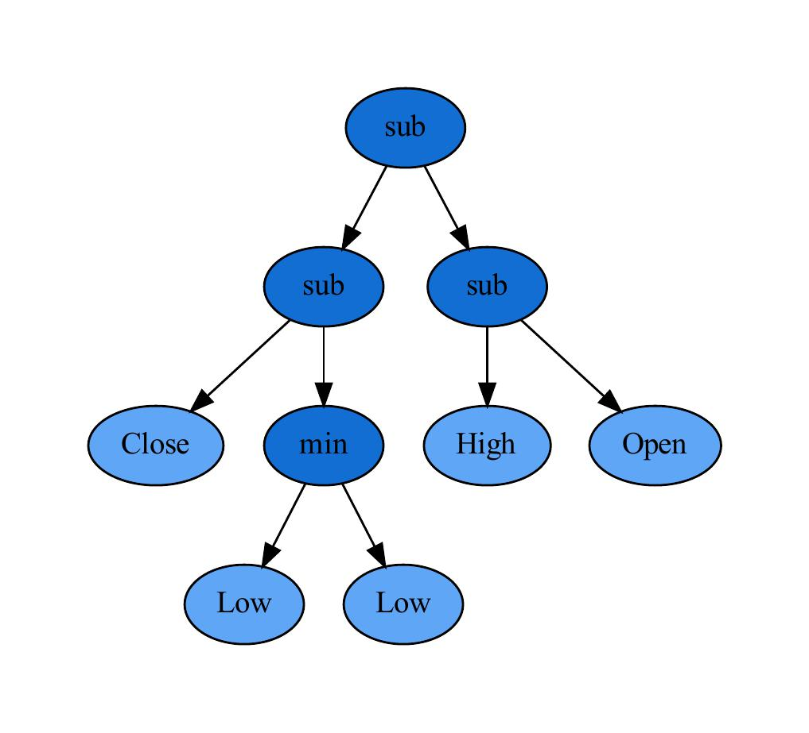

# use-gplearn-to-generate-CTA-factor
本项目使用gplearn模型进行因子生成，具体由以下两个文档构成  
- `timing_factor.py` 通过收益与回撤的比值生成时序因子  
- `stock_selection_factor.py` 通过5日IC生成选股因子    

本文档将说明各文件作用，如何使用本项目以及成果展示。如果希望进一步了解遗传算法的理论内容，可以参考`遗传算法实证思路梳理.pdf`
<!-- 在适应度函数定义方面，本文档采用收益回撤比进行定义。如何根据遗传规划算法得到因子值投资的细节参见simple-backtest项目。   -->

## 主要文档说明
* `gplearn`
  * `functions.py` 加了自己的函数
  * 其他py文件改了一些细节，使得可以输入ndarray
* `toolkit`
  * `backtest.py` 向量化回测框架
  * `DataProcess.py` 数据处理
  * `setupGPlearn.py` 设定gplearn
  * `IC.py` 计算IC
  * `my_plot.py` 画图的类
* `遗传算法实证思路梳理.pdf` 梳理遗传算法实证思路和本项目基本设定
* `timing_factor.py` 生成时序因子。这里通过收益/回撤的比值来刻画因子好坏，没考虑手续费，生成的因子结果还不错  
* `stock_selection_factor.py` 生成截面因子。这里通过`fadj_close`计算收益，可以换成`vwap`

## 使用方法
下载本文档 (Unix)
```
cd /path/to/your/directory
git clone git@github.com:wjsbjl/use-gplearn-to-generate-CTA-factor.git
cd ./use-gplearn-to-generate-CTA-factor
```
生成时序因子
```
python timing_factor.py
```
生成截面因子
```
python stock_selection_factor.py
```

## 模型效果展示
生成的截面因子形式如下（这里可能因为输入的数据已经是处理后的因子）



IC如下(5日IC -5.76%，10日IC -7.69%)


生成的时序因子形式如下



测试集内,回测效果如下


<!-- ## 版本说明
231127 `gplearn 1.0`
- 修改gplearn包，完成时序和选股因子生成

230831 `gplearn 2.0`
- 删去原有回测框架，改用更稳定的向量化回测
- 修改主文件形式和因子生成方法
- 曾经通过如下方法输入数据，在3.2被优化掉了
```Python
score_func_final = partial(score_func_basic, train_data=train_data)
score_func_final.__code__ = score_func_supplement.__code__
```

230303 `gplearn 1.0 `
- 基于简易的回测生成因子
- 预计单次回测及生成统计量运行时间为1.6s  
- 预计单次回测及生成统计量和图表运行时间为4.4s  

230215 通过input函数实现半自动化调参和结果保存，方便使用。
- 非常naive
- 预计单次回测及生成统计量运行时间为1.6s  
- 预计单次回测及生成统计量和图表运行时间为4.4s -->